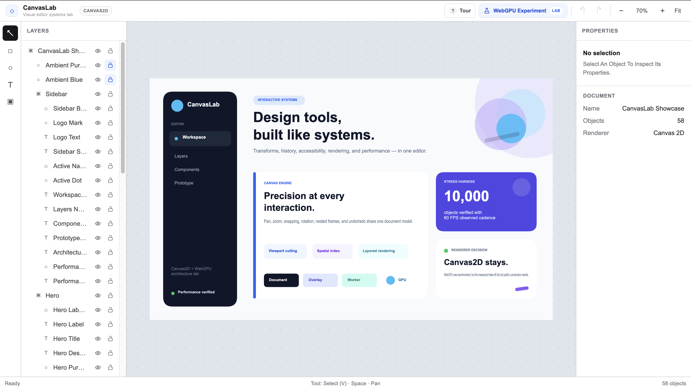

# CanvasLab

[](...)

**A production-style visual editor architecture playground built with React, Next.js, TypeScript, Canvas2D, Web Workers, and WebGPU experiments.**

CanvasLab explores the engineering behind interactive design tools rather than trying to recreate every feature of Figma or Canva. The project focuses on document modeling, coordinate systems, direct manipulation, undo/redo, accessibility, rendering performance, spatial indexing, worker boundaries, and evidence-based renderer decisions.

**Live demo:** https://seibashonia.dev/work/canvas-lab  
**WebGPU experiment:** https://seibashonia.dev/work/canvas-lab/gpu-experiment



---

## Why I Built This

Most frontend applications are dominated by forms, data fetching, routing, and component composition. Visual editors introduce a different class of problems:

- persistent document state vs transient interaction state
- world, local, and screen coordinate systems
- hit testing and geometry transforms
- resize, rotate, marquee selection, snapping, and multi-selection
- command history and gesture transactions
- canvas rendering under frequent interaction
- accessibility for a primarily visual interface
- performance strategies for large documents

CanvasLab is a focused environment for learning and demonstrating those systems in a production-style frontend architecture.

---

## Highlights

### Interactive editor

- Select, Rectangle, Ellipse, Text, and Frame tools
- Pan, zoom, and fit-to-document camera controls
- Click selection, Shift multi-select, and marquee selection
- Drag, resize, and rotate interactions
- Shift aspect-ratio constraints and Alt/Option center resize
- Multi-selection transforms
- Snapping and alignment guides
- Nested frame parenting with local/world transform preservation
- Editable rectangle and ellipse fill colors
- Multiline text editing with native DOM textarea behavior

### Commands and history

- Centralized command dispatch
- Undo/redo with before/after document and selection snapshots
- Gesture transactions that commit once at interaction boundaries
- History coalescing for repeated keyboard nudges
- Selection changes kept outside document history

### Accessibility architecture

CanvasLab keeps a single editor document as the source of truth and derives a parallel semantic DOM representation for assistive technology.

- Semantic mirror generated from the editor document
- Keyboard object navigation independent from visual selection
- Focus recovery when objects are hidden or deleted
- Live announcements for editor actions
- Roving keyboard navigation for the toolbar
- Native textarea for text editing, caret behavior, IME support, and browser accessibility

### Performance architecture

The renderer progressively avoids unnecessary work instead of relying on brute-force GPU rendering.

- Render invalidation model
- `requestAnimationFrame` render scheduler
- Viewport culling in world space
- Uniform-grid spatial index for hit-test broad phase
- Precise hit testing as the narrow phase
- Separate document and interaction overlay canvases
- Layer-level dirty rendering
- Web Worker boundary for large spatial-index rebuilds
- Deterministic stress harness for performance verification

### Guided portfolio experience

A first-visit product tour introduces the editor tools, layers, workspace, properties, history/zoom controls, and the WebGPU experiment. The tour can be replayed from the editor top bar.

---

## Architecture

```text
                               EditorDocument
                                     │
              ┌──────────────────────┼──────────────────────┐
              │                      │                      │
              ▼                      ▼                      ▼
       Interaction Engine        Command History       Semantic Mirror
              │                                             │
              │                                             ▼
              │                                      Accessibility DOM
              │
              ▼
         Hit Testing
              │
        Spatial Index
              │
        Precise Geometry
              │
              └──────────────────────┐
                                     │
                                     ▼
                              Render Invalidation
                                     │
                                     ▼
                                  Scheduler
                                     │
                              Dirty Render Layers
                          ┌──────────┴──────────┐
                          ▼                     ▼
                   Document Canvas        Overlay Canvas
                          │                     │
                    Viewport Culling      Selection / Guides
                          │                Marquee / Handles
                          ▼
                   DocumentRenderer
                          │
                          ▼
                   Canvas2DRenderer
```

The editor engine does not depend on a specific rendering backend. A small `DocumentRenderer` boundary allowed an isolated WebGPU renderer to be explored without rewriting selection, history, accessibility, or interaction systems.

---

## Document Model

The editor uses a normalized document model:

```text
EditorDocument
├── rootNodeIds
└── nodes
    ├── Frame
    │   └── childIds
    ├── Rectangle
    ├── Ellipse
    └── Text
```

Child `x` / `y` values are local to their parent frame, while root nodes use world coordinates. Geometry helpers recursively compose parent transforms to derive world matrices, corners, bounds, and inverse coordinate conversions.

When an object is created or dropped inside a frame, CanvasLab reparents it while preserving its world-space position and rotation.

---

## Rendering Strategy

### Production renderer: Canvas2D

Canvas2D remains the production renderer because it currently provides the best complexity/performance trade-off for CanvasLab.

The document renderer handles persistent artwork, while transient editor chrome is rendered on a separate overlay canvas:

```text
DOM Text Editor
────────────────────
Overlay Canvas
selection / handles / guides / marquee
────────────────────
Document Canvas
frames / rectangles / ellipses / text
```

This allows selection-only or marquee-only updates to redraw the overlay without redrawing document pixels.

### WebGPU experiment

CanvasLab also includes an isolated WebGPU rectangle renderer using GPU instancing. It exists to test renderer architecture and performance rather than to replace Canvas2D by default.

The experiment compares the same deterministic rectangle workload, camera path, canvas size, warm-up period, and measurement period for both renderers.

| Workload          | Canvas2D Avg |  WebGPU Avg | Canvas2D P95 | WebGPU P95 |         Cadence |
| ----------------- | -----------: | ----------: | -----------: | ---------: | --------------: |
| 1,000 rectangles  |  **1.69 ms** |     2.40 ms |  **2.20 ms** |    3.20 ms | 60 FPS / 60 FPS |
| 4,000 rectangles  |  **2.46 ms** |     5.00 ms |  **2.70 ms** |    5.80 ms | 60 FPS / 60 FPS |
| 10,000 rectangles |      5.80 ms | **5.76 ms** |  **6.30 ms** |    6.50 ms | 60 FPS / 60 FPS |

### Decision

Canvas2D remains the production renderer.

The WebGPU prototype did not show a large enough runtime advantage to justify rebuilding hierarchy rendering, clipping, text, ellipses, and other production semantics. At 10,000 rectangles the average synchronous render-call cost was effectively equivalent, while both renderers maintained 60 FPS in the measured environment.

See the full decision record: [`docs/architecture/renderer-decision.md`](docs/architecture/renderer-decision.md).

> The benchmark measures synchronous CPU-side render-call cost and observed `requestAnimationFrame` cadence. WebGPU queue execution is asynchronous, so these values are not raw GPU execution times.

---

## Performance Pipeline

```text
Interaction / Document Change
            │
            ▼
   Render Invalidation
            │
            ▼
     Frame Scheduler
            │
            ▼
      Dirty Layers
       │         │
       ▼         ▼
   Document    Overlay
       │
       ▼
 Viewport Culling
       │
       ▼
 Canvas2D Rendering
```

Hit testing follows a separate broad-phase / narrow-phase pipeline:

```text
Pointer in world space
        │
        ▼
Uniform-grid spatial index
        │
        ▼
Small candidate set
        │
        ▼
Precise transformed hit test
```

For large committed documents, spatial-index construction can be warmed in a Web Worker. Immediate interaction remains on the main thread, and CanvasLab falls back to full precise hit testing while a worker result is unavailable.

---

## Keyboard Shortcuts

| Shortcut               | Action                                |
| ---------------------- | ------------------------------------- |
| `V`                    | Select tool                           |
| `R`                    | Rectangle tool                        |
| `O`                    | Ellipse tool                          |
| `T`                    | Text tool                             |
| `F`                    | Frame tool                            |
| `Space` + drag         | Pan canvas                            |
| Arrow keys             | Nudge selection by 1 unit             |
| `Shift` + Arrow keys   | Nudge selection by 10 units           |
| `Delete` / `Backspace` | Delete selection                      |
| `Enter`                | Edit selected text                    |
| `Esc`                  | Clear selection / cancel text editing |
| `Cmd/Ctrl + Enter`     | Commit text editing                   |
| `Cmd/Ctrl + Z`         | Undo                                  |
| `Cmd/Ctrl + Shift + Z` | Redo                                  |
| `Ctrl + Y`             | Redo                                  |

Tool shortcuts are ignored while typing in inputs, textareas, selects, buttons, links, or editable content.

---

## Tech Stack

- **Next.js 16** — application shell and routing
- **React 19** — editor UI and application state integration
- **TypeScript** — editor/domain modeling
- **Canvas2D** — production document and overlay rendering
- **WebGPU** — isolated renderer experiment
- **Web Workers** — background spatial-index preparation for large documents
- **Vitest** — geometry, interaction, history, accessibility, renderer, and performance tests
- **GitHub Actions** — automated quality checks

No canvas/editor framework is used. Core camera, geometry, interaction, history, rendering, and performance systems are implemented directly in the project.

---

## Project Structure

```text
src/editor/
├── accessibility/      semantic mirror, focus model, announcements
├── camera/             world/screen camera transforms
├── commands/           command dispatch, history, gesture transactions
├── components/         editor shell, canvas, toolbar, properties, product tour
├── document/           normalized model, geometry, metadata, parenting
├── experiments/        Canvas2D vs WebGPU benchmark UI
├── geometry/           affine matrix primitives
├── performance/        invalidation, culling, spatial index, workers, benchmarks
├── renderer/           Canvas2D, overlays, renderer boundary, WebGPU prototype
├── selection/          selection state, hit testing, marquee, hierarchy
├── state/              centralized editor state
├── tools/              tool definitions and shortcuts
└── transform/          resize, rotate, snapping, multi-selection transforms
```

---

## Run Locally

### Requirements

- Node.js `24.11.1` — see `.nvmrc`
- npm
- A modern browser
- WebGPU support is only required for the optional GPU experiment

### Install

```bash
npm install
```

### Development

```bash
npm run dev
```

Open:

```text
http://localhost:3000/work/canvas-lab
```

WebGPU experiment:

```text
http://localhost:3000/work/canvas-lab/gpu-experiment
```

### Quality checks

```bash
npm run check
```

This runs:

```text
ESLint
→ TypeScript typecheck
→ Vitest
→ Next.js production build
```

CI uses a clean npm install and the same project quality checks.

---

## What I Learned

CanvasLab was built to understand the architecture behind interaction-heavy frontend systems rather than memorize API syntax.

The most important takeaways were:

- model persistent document state separately from transient interaction state
- treat coordinate conversion as a first-class domain problem
- commit history at meaningful interaction boundaries, not every pointer movement
- optimize by eliminating unnecessary work before introducing more powerful rendering technology
- separate persistent artwork from transient editor chrome
- use broad-phase spatial queries without giving up precise geometry semantics
- preserve accessibility through a semantic representation derived from the same document source of truth
- introduce Workers and GPU APIs only where their execution model actually fits the workload
- benchmark alternative architectures before accepting additional complexity

---

## Scope

CanvasLab is intentionally an **architecture playground**, not a full design-tool clone.

Features such as production collaboration, advanced typography, vector paths, image editing, effects, plugin systems, and a complete GPU renderer are outside the current project scope. The goal is to demonstrate the frontend systems and engineering trade-offs behind an interactive editor.

---

## License

This project is currently maintained as a personal portfolio project.
